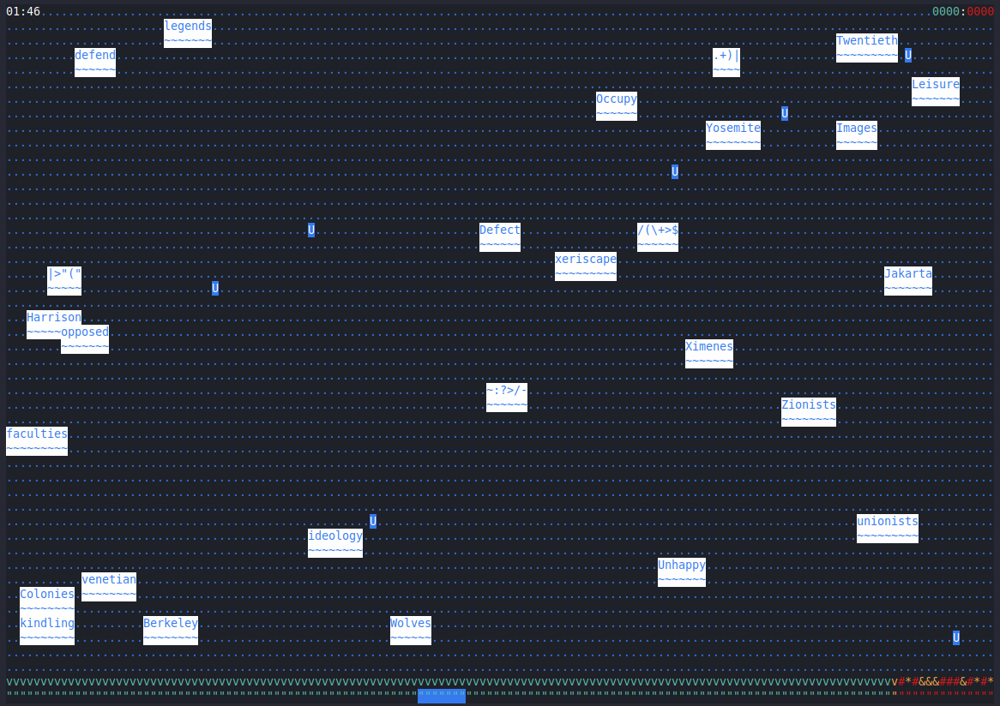

# QWENCH



## Installation

### Clone and build (assumes Rust Cargo is installed)

```bash
git clone https://github.com/BitPusher16/qwench.git
cd qwench
cargo install --path .
```

### Build without clone (assumes Rust Cargo is installed)
```bash
cargo install --git https://github.com/BitPusher16/qwench.git
```

### Download precompiled binary

Go to the [latest release](https://github.com/BitPusher16/qwench/releases/latest) and download the binary for your OS.
